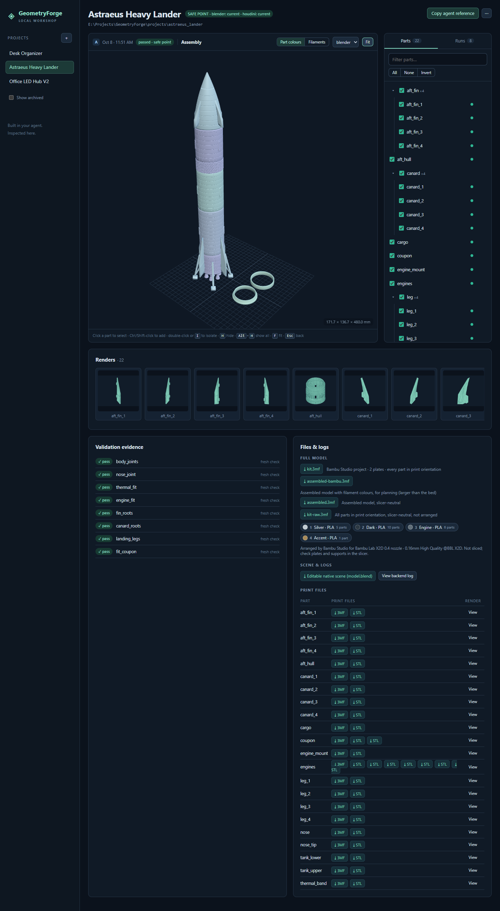

# GeometryForge

**Model in your agent. Keep editable native files. Inspect every iteration.**

[](https://github.com/DavidKahl/GeometryForge/actions/workflows/ci.yml)
[](LICENSE)


GeometryForge lets a coding agent, [Claude Code](https://docs.claude.com/en/docs/claude-code/overview) or [Codex](https://developers.openai.com/codex), build 3D-printable models as real, editable **Blender** and **Houdini** projects. You describe what you want in plain language. The agent writes the modeling code, and GeometryForge runs it in the native applications, checks the result, exports print files and keeps a history of every iteration that you can inspect in a local browser viewer.



## Watch the introduction

[](https://youtu.be/L7bTOa_qrdc)

How GeometryForge came to be, from hand-modeled chess pieces to agent-built, validated print kits: [watch on YouTube](https://youtu.be/L7bTOa_qrdc).

## What you get

- **Editable native files, not just meshes.** Every part is built with Blender modifiers or Houdini nodes and saved as a `.blend` / `.hip` file you can open, tweak and hand back to the agent.
- **Incremental runs.** Change one part and only that part and the checks that depend on it are rebuilt. Unchanged parts reuse their verified evidence.
- **Safe points.** A run that passes every check in every requested application becomes a safe point. Failed or partial attempts never replace it, and you can always restore it.
- **Print-ready output.** Each part is exported as STL and 3MF in its print orientation and checked for watertightness, volume, bed fit and an STL/3MF round trip. Projects add their own fit and interface checks.
- **Multi-material 3MF.** Every run also writes the whole model as one 3MF: an assembled version for judging colours and a print kit with every part. With [Bambu Studio](https://bambulab.com/en/download/studio) installed, the kit becomes a ready-to-slice project with plates and filament colours.
- **A local viewer.** Browse projects and runs, isolate parts, compare any two runs side by side or as an overlay, view renders and download files.
- **No AI service of its own.** GeometryForge has no API keys, model provider or chat. Your existing agent does the thinking; GeometryForge does deterministic execution and bookkeeping.

## Requirements

| | Required | Notes |
|---|---|---|
| Python 3.12 and [uv](https://docs.astral.sh/uv/) | Yes | uv manages the environment |
| An agent harness | Yes | Claude Code or Codex |
| [Blender](https://www.blender.org/download/) | At least one of the two | Verified with 5.2.1 LTS |
| [Houdini](https://www.sidefx.com/download/) | At least one of the two | Verified with 22.0 (Apprentice works, saves `.hipnc`) |
| [Bambu Studio](https://bambulab.com/en/download/studio) | Optional | Verified with 2.8.2; arranges the multi-material print kit |
| Node.js 22 | Only for development | End users get the prebuilt viewer |

**Platform:** Windows is the verified platform. The code is portable and the automated tests also run on Linux, but native Blender/Houdini operation on macOS and Linux has not been verified yet.

## Install

```powershell
git clone https://github.com/DavidKahl/GeometryForge.git
cd GeometryForge
uv sync --frozen --extra viewer
uv run geometryforge doctor
```

`doctor` shows which Blender, Houdini and Bambu Studio executables were found. GeometryForge looks at environment variables first, then your `PATH`, then the standard Windows install folders. If something isn't found, point to it:

```powershell
$env:GEOMETRYFORGE_BLENDER = 'C:/path/to/blender.exe'
$env:GEOMETRYFORGE_HOUDINI = 'C:/Program Files/Side Effects Software/Houdini 22.0.368'
$env:GEOMETRYFORGE_BAMBU   = 'C:/Program Files/Bambu Studio/bambu-studio.exe'   # optional
```

To use GeometryForge from another Python environment, install the checkout as a package with `uv pip install "path/to/GeometryForge[viewer]"` (omit `[viewer]` for the command line only). It isn't on PyPI yet.

### Install the skill for your agent

The skill teaches your agent the workflow: establish the brief and printer, model each part natively, plan, run, read the evidence and report honestly.

```powershell
uv run geometryforge install-skill --target C:/Models/MyWorkspace   # one workspace
uv run geometryforge install-skill --user                           # all your projects
```

This writes `.claude/skills/geometryforge` and `.agents/skills/geometryforge` (for Codex). Existing `CLAUDE.md`/`AGENTS.md` files are left alone, and locally modified skill files are never overwritten. Restart your agent if the skill doesn't show up.

## Your first project

```powershell
uv run geometryforge init C:/Models/Organizer --example desk_organizer --deliverables both
uv run geometryforge plan C:/Models/Organizer
uv run geometryforge run C:/Models/Organizer
uv run geometryforge viewer
```

Open <http://127.0.0.1:8743> to see the result. Then start your agent in that folder and ask, for example:

> Use GeometryForge to make this organizer 150 mm wide with four compartments. Keep both native projects editable, reuse unaffected checks, and show me the resulting run.

For a new model, just describe it, including the printer you'll use:

> Use GeometryForge to design a wall-mounted holder for two game controllers. I print on a Bambu X1C with a 0.4 mm nozzle in PLA. Blender only.

The agent asks only for decisions that change the design, writes the brief, dimensions and print plan into the project, and builds part by part. On Windows, double-click `Launch Viewer.cmd` in this repository to start the viewer.

## Showcase: Astraeus Heavy Lander

[`projects/astraeus_lander`](projects/astraeus_lander) is a 480 mm, 22-part display model of a fictional heavy lander, built entirely by an agent with GeometryForge from a single concept sheet. It has native Blender and Houdini versions, eight interface checks and a four-colour filament plan for a Bambu Lab X2D. See its [README](projects/astraeus_lander/README.md) and [print and assembly guide](projects/astraeus_lander/PRINT_AND_ASSEMBLE.md).

The printable files (STL, 3MF, the Bambu print kit and the native scenes) are attached to the [GitHub release](https://github.com/DavidKahl/GeometryForge/releases), so you can print it without Blender or Houdini.

## How it works

```text
you ──► agent (Claude Code / Codex) ──► project files: models/, checks/, parameters.json, decisions.json
                                            │
                    geometryforge plan/run  ▼
        Blender / Houdini build the parts ──► checks ──► STL / 3MF / previews ──► run record
                                                                                    │
                                                         local viewer  ◄────────────┘
```

| Term | Meaning |
|---|---|
| **Project** | A folder with `project.toml` (parts, builders, checks and their dependencies), `parameters.json` (dimensions), `decisions.json` (brief, printer, filaments) and the modeling code in `models/` and `checks/`. |
| **Run** | One execution. It snapshots its inputs, builds the selected parts, exports and checks them, and records everything under `.geometryforge/runs/<id>`. |
| **Safe point** | The latest run that passed every required check in every requested application. |
| **Candidate** | Kept work whose coverage is incomplete or whose scope was uncertain. It never replaces the safe point. |
| **Working scene** | The editable `.blend`/`.hip` under `working/`. Save your manual edits there, then ask the agent to continue. GeometryForge detects the change. |

The [user guide](docs/GUIDE.md) covers the full workflow: editing native files by hand, restoring, the command reference, the project files, multi-material printing and troubleshooting.

## Limits, honestly

- Geometry checks don't replace slicing, a material-specific fit test or a physical print. Print the fit coupon first.
- GeometryForge exports STL and 3MF. It never slices for you or sends anything to a printer.
- Blender and Houdini versions are separate native implementations of the same design intent, compared by dimensions and volume. There's no automatic translation of construction history between them.
- Project scripts are trusted local code and run unsandboxed in your applications. Only run projects you trust. See [SECURITY.md](SECURITY.md).
- Houdini's own license terms (e.g. Apprentice: non-commercial, `.hipnc`) still apply to the files it produces.

## Documentation

- [User guide](docs/GUIDE.md): workflow, commands, project files, multi-material printing, troubleshooting
- [Architecture](docs/ARCHITECTURE.md): how runs, evidence reuse, recovery and the viewer work
- [Validation](docs/VALIDATION.md): what has actually been verified, on what
- [The agent skill](geometryforge/skill/SKILL.md) and its [project contract](geometryforge/skill/references/contracts.md) and [printing guidance](geometryforge/skill/references/printing.md)
- [Changelog](CHANGELOG.md)

## Contributing

Bug reports, ideas and pull requests are welcome. Please read [CONTRIBUTING.md](CONTRIBUTING.md) and the [code of conduct](CODE_OF_CONDUCT.md). Report security issues privately as described in [SECURITY.md](SECURITY.md).

## License

[MIT](LICENSE) © 2026 David Kahl. Blender, Houdini and Bambu Studio are separate products under their own licenses and are not distributed here. See [third-party notices](THIRD_PARTY_NOTICES.md).
