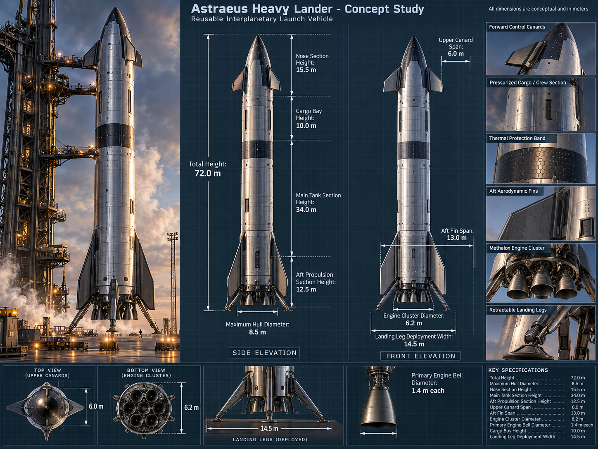

# Astraeus Heavy Lander

A 480 mm, 22-part display model of a fictional heavy lander, designed for a **Bambu Lab X2D** with a 0.4 mm nozzle and a 256 mm bed. An agent built it with GeometryForge from a single [concept sheet](references/astraeus-concept-sheet.png); the [design brief](references/design-brief.md) records how the sheet was interpreted for printing.



The native models keep a hollow segmented hull, weld seams, recessed fasteners and hatches, a hex-tile thermal sleeve, a separate dark nose cap, swept fins and canards, seven hollow engine bells and deployed landing legs. Every part exists as editable Blender modifiers and Houdini nodes.

- **Print it:** download the print package from the [GitHub release](https://github.com/DavidKahl/GeometryForge/releases) and follow the [print and assembly guide](PRINT_AND_ASSEMBLE.md).
- **What was verified:** [VALIDATION.md](VALIDATION.md).

## Filament plan

The model's material colours map to four filament slots (`filament_slots` in `parameters.json`, described in `decisions.json`):

| Slot | Colour | Parts |
|---|---|---|
| 1 | Silver `#BFCAD1` | aft_hull, tank_lower, tank_upper, cargo, nose |
| 2 | Dark `#2C3842` | aft fins, canards, nose_tip, thermal_band |
| 3 | Engine grey `#616F79` | engines, engine_mount, landing legs |
| 4 | Accent `#A68959` | fit coupon |

The presets are Generic PLA placeholders in those colours. Choose your real filaments in Bambu Studio.

## Rebuild or revise

You need Blender and Houdini (Apprentice is fine), plus this project's extra check dependency:

```powershell
uv pip install -r projects/astraeus_lander/requirements-checks.txt
uv run geometryforge context projects/astraeus_lander
uv run geometryforge plan projects/astraeus_lander
uv run geometryforge run projects/astraeus_lander
```

`project.toml` declares the 22 part IDs, their source and parameter dependencies, and the eight interface checks. To change a part, edit its module under `models/` (or ask your agent), check the plan, and run again. For a native edit, save the working scene and run `geometryforge context` before deciding how to continue.

The project checker measures exported geometry and uses [Manifold](https://github.com/elalish/manifold) for solid-intersection checks.

## Tools

| Tool | Purpose |
|---|---|
| `tools/render.py` | Review renders of the actual native scene: `blender -b <model.blend> --python tools/render.py -- review` |
| `tools/slice_check.py` | Offline Bambu Studio slicing with the installed X2D presets, as extra evidence. Never sends a print job. |
| `tools/package_release.py` | Builds the hash-verified print package from the current safe point |

`slice_check.py` follows [Bambu Studio's command-line documentation](https://github.com/bambulab/BambuStudio/wiki/Command-Line-Usage) and reads presets from your installation instead of redistributing them.
